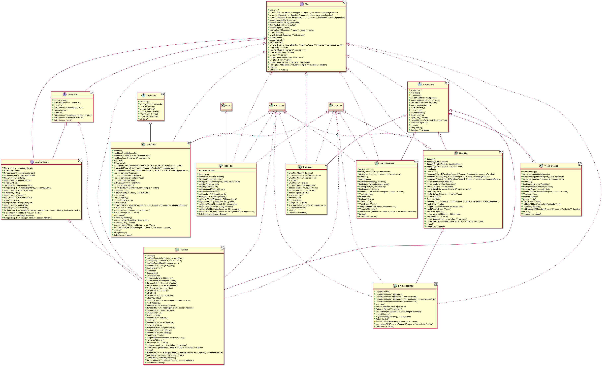

# plantuml-generator
[](https://github.com/tagnja/plantuml-generator/stargazers)
[](https://github.com/tagnja/plantuml-generator/network/members)
[](https://github.com/tagnja/plantuml-generator/issues)
[](https://github.com/tagnja/plantuml-generator/pulls)
[](https://travis-ci.com/tagnja/plantuml-generator)

## What's plantuml-generator

**plantuml-generator** is a tool for generating PlantUML text. It can help you understanding the classes hierarchy by its UML class diagram. The plantuml-generator automate generating [PlantUML](https://plantuml.com/) text by specifying a [Javadoc](https://en.wikipedia.org/wiki/Javadoc#:~:text=Javadoc%20(originally%20cased%20JavaDoc)%20is,format%20from%20Java%20source%20code.) API website URL. It fetches Javadoc HTML pages of any Javadoc API websites such as [Java SE](https://docs.oracle.com/javase/8/docs/api/) and [Spring framework](https://docs.spring.io/spring-framework/docs/current/javadoc-api/), then it parses HTML pages to a PlantUML text.

The following examples are using this `plantuml-generator` tool to generate PlantUML text and then using `plantuml.jar` to generate UML class diagram picture.

Example 1:

```shell
java -jar plantuml-generator.jar -u https://docs.oracle.com/javase/8/docs/api/ -p java.util -c Map -m false
```

Running the above command, you will get the PlantUML text file: classDiagram-java-util-Map-(without-members).txt

```shell
java -jar plantuml.jar classDiagram-java-util-Map-(without-members).txt
```

Running the second command, You will get the class diagram picture file: classDiagram-java-util-Map-(without-members).png. The picture is shown below.

.png)

Example 2:

```shell
java -jar plantuml-generator.jar -u https://docs.oracle.com/javase/8/docs/api/ -p java.util -c Map
```

```shell
java -jar plantuml.jar classDiagram-java-util-Map.txt
```



## How to develop

To develop plantuml-generator, you need to install the following software:

- Git
- JDK 8
- Maven

You can choose any Java IDE to develop this project, We strongly suggest you use the [IntelliJ IDEA](https://www.jetbrains.com/idea/).

## How to run

### How to run with Maven command line

1. Clone project source code to your local computer

   ```shell
   git clone https://github.com/tagnja/plantuml-generator.git
   ```

2. Running the project with maven command line

   ```shell
   mvn exec:java -Dexec.mainClass="com.taogen.docs2uml.Main" -Dexec.args="-u https://docs.oracle.com/javase/8/docs/api/ -p java.nio"
   ```

### How to run with the executable jar file

1. To get this project executable jar file

   - You can get the executable jar file by downloading from [GitHub releases](https://github.com/tagnja/plantuml-generator/releases).

   - You can also get the executable jar file by using Maven command to package the source code. The target packaged jar file is `plantuml-generator-jar-with-dependencies.jar`, and you can rename to `plantuml-generator.jar` or others.

   ```shell
   # clone this project to your local computer
   git clone https://github.com/tagnja/plantuml-generator.git
   # package source code to jar
   mvn package -Dmaven.test.skip=true
   # rename jar file
   mv target/plantuml-generator-jar-with-dependencies.jar target/plantuml-generator.jar
   ```

2. Running the jar file

   You can run the following command to run the jar file. 

   ```shell
   java -jar plantuml-generator.jar -u <javadoc_url> -p <package_path> 
   ```

   For example:

   ```shell
   java -jar plantuml-generator.jar -u https://docs.oracle.com/javase/8/docs/api/ -p java.nio
   ```

After running this project, you will get the PlantUML text. More details about this command refer to "Usage" section of this README.


## Using the plantuml.jar to generate UML diagram pictures

Once you get a PlantUML text file by running this project. Then you can use `plantuml.jar`  to generate a UML diagram by the PlantUML text file.

### How to get `plantuml.jar`

You can download the `plantuml.jar` from [PlantUML](https://plantuml.com/download).

### How to use `plantuml.jar`

Running the following command to get the UML diagram:

```shell
java -jar plantuml.jar <plantuml_text_filepath>
```

More detail about PlantUML usage refer to [PlantUML](https://plantuml.com/download) website.

There are some common problems for using the `plantuml.jar`:

- If the generating picture can't contain all classes information, you need to set generating configuration to increase the size of picture. The configuration is `-DPLANTUML_LIMIT_SIZE=<your_specified_size>`. For example, 

  ```shell
  java -DPLANTUML_LIMIT_SIZE=8192 -jar plantuml.jar plantuml_text.txt
  ```

- If you can't use plantuml.jar to generating diagram. Ensure you installed [JDK](https://www.java.com/en/download/) and [Graphviz](https://plantuml.com/graphviz-dot).

  

## Usage

| Option             | Description                                                  | Default | Required | Examples                                                     |
| ------------------ | ------------------------------------------------------------ | ------- | -------- | ------------------------------------------------------------ |
| -u or --url        | The Javadoc website URL.                                     | null    | Yes      | -u https://docs.oracle.com/javase/8/docs/api/, or -u http://localhost/java-docs |
| -p or --package    | The package path you want to generate.                       | null    | Yes      | -p java.nio                                                  |
| -s or --subpackage | Whether fetch the subpackage.                                | false   | No       | -s true                                                      |
| -m or --members    | Whether contains classes' members.                           | true    | No       | -m false                                                     |
| -c or --class      | Only generating parent classes and subclasses of a specified class. | null    | No       | -c Buffer                                                    |

Note: We strongly suggest to download Javadoc that you need and to deploy the Javadoc in your local PC. It's faster, and be more friendly to other websites. 

**Get Javadoc**

Downloads Javadoc online:

- [Java SE](https://www.oracle.com/java/technologies/javase-downloads.html)
- [Spring framework](https://repo.spring.io/libs-release/org/springframework/spring/)
- [MyBatis](https://javadoc.io/doc/org.mybatis/mybatis/latest/index.html)
- [Hibernate](https://hibernate.org/orm/releases/)
- ...

Generating Javadoc with source code:

```shell
javadoc -d <javadoc_output_path> -sourcepath <src_dir> -subpackages java:<your_package_path>
```

For example:

```shell
javadoc -d ./api-docs -sourcepath src/main/java -subpackages java:com.taogen.docs2uml
```

